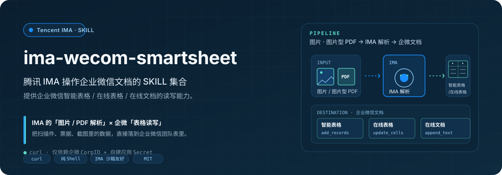
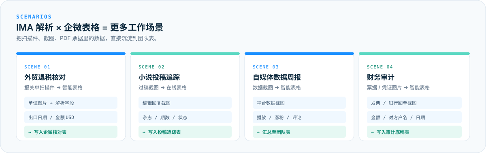
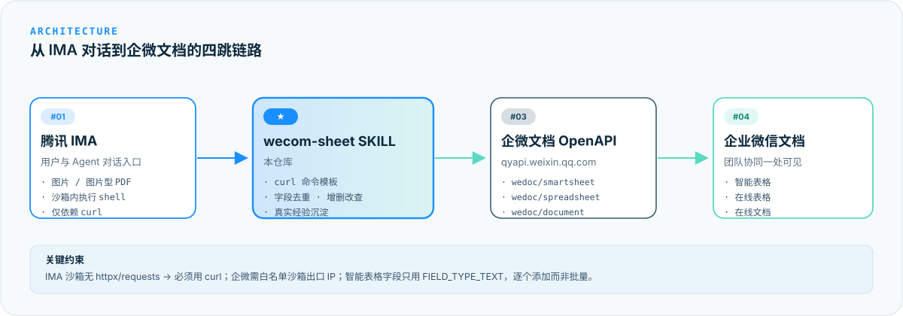

# ima-wecom-smartsheet

> 腾讯 IMA 操作企业微信文档的 SKILL 集合，提供企业微信智能表格 / 在线表格 / 在线文档的读写能力。

---

## 它是什么

`ima-wecom-smartsheet` 是一个为 [腾讯 IMA](https://ima.qq.com/) 知识库量身打造的 **SKILL 集合**，让 IMA 智能体能直接读写企业微信里的三类文档：

| 文档类型 | 能力 |
|:---|:---|
| **智能表格（SmartSheet）** | `add_records` · `get_records` · `update_records` |
| **在线表格（Spreadsheet）** | `get_spreadsheet_data` · `update_spreadsheet_cells` |
| **在线文档（Document）** | `get_document` · `append_document_text` |

实现机制是 **纯 shell + `curl` 调用企微文档 OpenAPI**，不依赖 `httpx` / `requests`，对 IMA 沙箱环境零打扰。

---

## 为什么是 IMA × 企业微信

腾讯 IMA 知识库的核心优势之一是**直接解析图片与图片型 PDF**——把扫描件、票据、截图丢进去，IMA 就能识别其中字段。再叠加上这个 SKILL 提供的企业微信表格读写能力，就能组合出大量原本"需要人工搬运"的工作场景：

- **外贸退税核对** —— 把报关单扫描件丢给 IMA → 自动解析出报关单号、出口日期、金额 → 写入企微「退税核对表」
- **小说投稿追踪** —— 编辑过稿回复截图 → IMA 识别杂志名 / 期数 / 状态 → 写入团队「投稿追踪表」
- **自媒体数据周报** —— 各平台数据截图 → IMA 解析涨粉 / 播放 → 写入团队「数据周报表」
- **财务审计** —— 发票 / 银行回单截图 → IMA 提取金额、对方户名、日期 → 写入团队「审计底稿表」

把 IMA 的"看图识字段"和本 SKILL 的"往企微表里写"接起来，就是把"非结构化数据 → 结构化团队表"的最后一步自动化。

---

## 它怎么工作

四跳链路：

| # | 节点 | 说明 |
|:--:|:---|:---|
| 1 | 腾讯 IMA | 用户与 Agent 对话入口，支持图片 / 图片型 PDF |
| 2 | **wecom-sheet SKILL**（本仓库） | 提供 curl 命令模板、字段去重、增删改查 |
| 3 | 企微文档 OpenAPI | `qyapi.weixin.qq.com/cgi-bin/wedoc/...` |
| 4 | 企业微信文档 | 智能表格 / 在线表格 / 在线文档 |

---

## 包含 Skills

| Skill | 用途 |
|:---|:---|
| [`skills/wecom-sheet/`](skills/wecom-sheet/SKILL.md) | 企业微信智能表格、在线表格、在线文档读写，适配 IMA / Claude 等沙箱环境 |

每个 skill 子目录里都有独立的 `SKILL.md`、curl 命令模板、踩坑总结和 Python 客户端示例，按 Skill 文档调用即可。

---

## 5 分钟上手

### 1. 准备企微凭证（两种方式选其一）

**方式 A — 配一次永久用（推荐）**
在 IMA 个人知识库里建一条笔记，标题 `我的企业微信文档凭证`，内容按 [`skills/wecom-sheet/references/credentials_template.md`](skills/wecom-sheet/references/credentials_template.md) 模板填好 `WECOM_CORPID` 与 `WECOM_SECRET`。Agent 会自动读取，**之后每次对话都不用再贴**。

**方式 B — 当轮贴**
直接在 IMA 对话里把 CORPID + SECRET 发给 Agent。适合临时调试或不想存知识库的场景。

### 2. 企微后台一次性配置

- `WECOM_CORPID` —— 企业 ID（我的企业 → 页面底部）
- `WECOM_SECRET` —— **自建应用**（不是机器人）的 Secret
- 应用详情里勾选「文档」「智能表格」权限
- 「企业可信 IP」配置为 IMA 沙箱出口 IP（指南见 [`skills/wecom-sheet/references/setup_guide.md`](skills/wecom-sheet/references/setup_guide.md)）

> **注意：** IMA 沙箱环境的公网 IP 会变动，因此可能需要经常在企业微信应用中重新添加 IP 白名单。如果遇到 `errcode: 60020` 错误，请检查并更新 IP 白名单配置。

### 3. 一句话使用

在 IMA 里说：

> "帮我创建一张『出口退税核对表』，把这份报关单图片里的字段都写进去。"

IMA Agent 会：
1. 解析你给的图片 / PDF，提取字段
2. **按"凭证获取策略"自动从 IMA 知识库读取** CORPID + SECRET，拿 access_token
3. 在企微智能表格里逐字段建表 / 写入
4. 返回一个你能在企微客户端打开的文档链接

---

## 已知限制 & 已踩的坑（实战沉淀）

这些都已经写进了 `SKILL.md` 和 `references/setup_guide.md`：

| 问题 | 原因 | 解法 |
|:---|:---|:---|
| `ModuleNotFoundError: httpx` | IMA 沙箱没有该模块 | **用 `curl`**，别 `pip install` |
| `errcode: 60020` | IMA 沙箱出口 IP 没加白名单（IP 会变动） | 在企微管理后台「企业可信 IP」补上，IP 变动时需重新添加 |
| `errcode: 2022017` | `FIELD_TYPE_NUMBER` 校验失败 | **全用 `FIELD_TYPE_TEXT`**，金额日期也存文本 |
| 部分字段写入失败 | 批量 `add_fields` 风险 | **逐个**调用 `add_fields`，每次传 1 个字段 |
| 文档链接打不开 | API 建表默认没用户权限 | **让用户在企微里手动建表**，把链接发给 Agent |

---

## License

MIT
